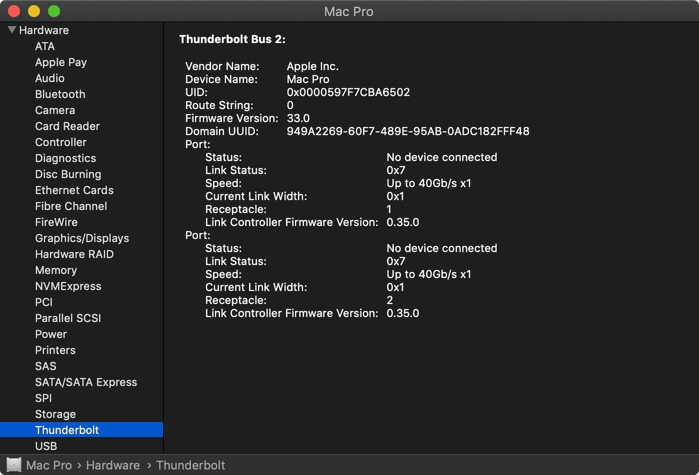
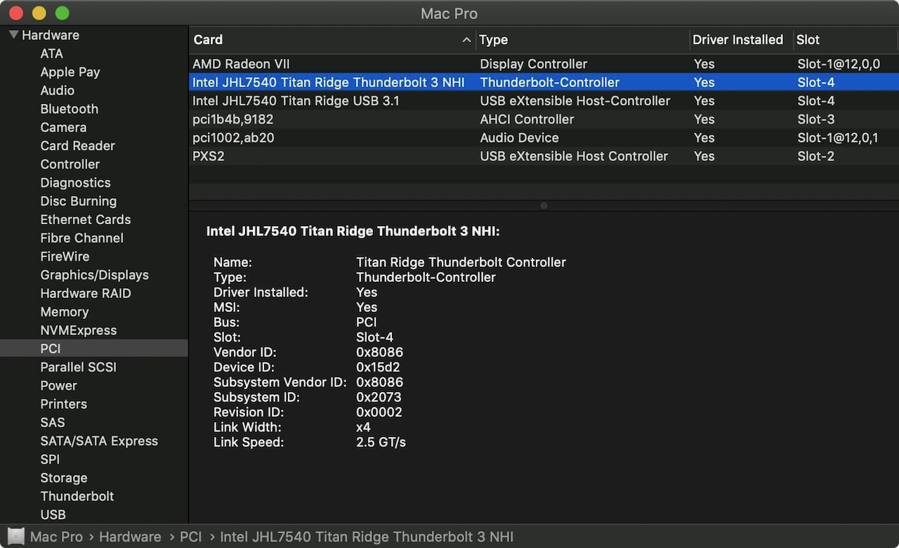
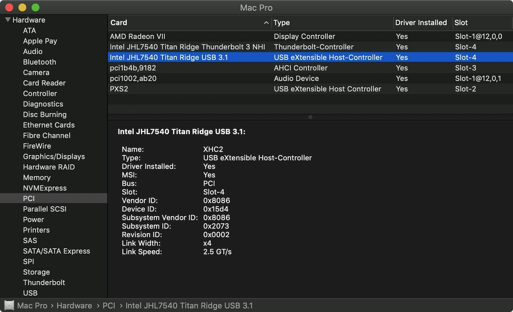

[Home](./README.md) ▸ Thunderbolt Mac Pro Early 2009 with Gigabyte GC-Alpine Ridge Card

# [Thunderbolt Mac Pro Early 2009 with Gigabyte GC-Alpine Ridge Card](https://ameyrupji.github.io/thunderbolt-macpro-5-1/GC-AlpineRidge.html)

This is my story to add Thunderbolt support to my Mac Pro Early 2009 (5,1) with a Gigabyte GC-Alpine Ridge Card. Before we begin a quick disclaimer below.

**Difficulty Level:** Medium

> **Disclaimer:** Try this at your own risk. I do not guaranty that this will work for you but I hope it does. This is purely for educational purposes and I am not responsible for any void in warranty. This is not a end all be all guide for getting the GC-Titan Ridge thunderbolt card working for every use case. These steps have worked for me but there might be additional steps that might be required for getting other thunderbolt devices to work. Please follow the links mentioned in the the `Useful Links` section below for more update to date information about the community postings on this topic.

## About my Mac Pro 5,1

My mac pro has the following configurations:

- Processor:        2 x 3.33 Ghz 6-Core Intel Xeon (X5680)
- Memory:           96 GB 1066 Mhz DDR3 ECC
- Graphics          AMD Radeon RX 580 8 GB

My purchase and upgrade story can be found [here](https://ameyrupji.github.io/macpro-5-1/) ([Github View](https://github.com/ameyrupji/macpro-5-1)).

## Prerequisites

- Obviously a Mac Pro and a Gigabyte GC-Alpine Ridge Card [Amazon](https://amzn.to/31m8LeJ)
- EEPROM Flash Bios USB Programmer [Amazon](https://amzn.to/37kgwTJ)
- Custom firmware for the Gigabyte GC-Alpine Ridge Card v2.0 [Download](https://www.tonymacx86.com/threads/thunderbolt-3-modified-firmware-custom-ssdt-discussion.293279/).

## Upgrade Journey Findings

Use the [Video Tutorial](https://www.youtube.com/watch?v=nFO54LKzRAw) and the documentation on the [GC-Titan Ridge](./GC-TitanRidge.md) for reference for flashing card!

### View System Report of your MacPro

The system report should successfully detect thr alpine ridge card.

### USB 3.1

The card is also detected successfully as a PIC Hardware as a thunderbolt and USB 3.1 device.

## Useful links

- Video Tutorial: https://www.youtube.com/watch?v=nFO54LKzRAw
- Firmware Download: https://www.tonymacx86.com/threads/thunderbolt-3-modified-firmware-custom-ssdt-discussion.293279/
