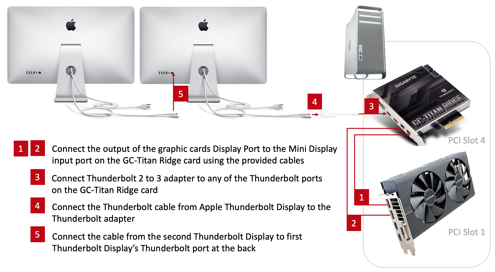
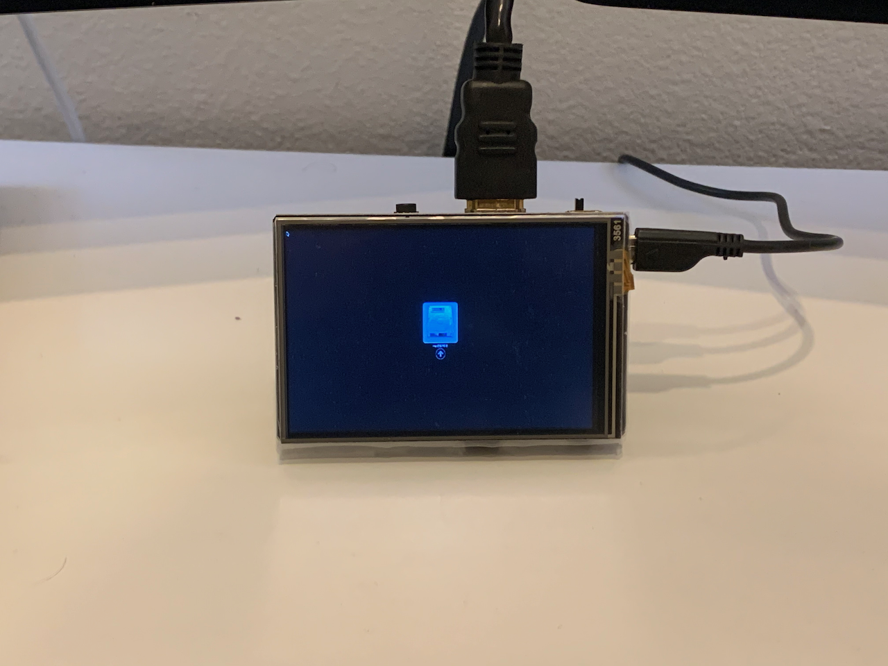

[Home](./README.md) ▸ [Thunderbolt Mac Pro Early 2009 with Gigabyte GC-Titan Ridge Card](./GC-TitanRidge.md) ▸ Mac Pro Early 2009 + Apple Thunderbolt Display

# [Mac Pro Early 2009 + Apple Thunderbolt Display](https://ameyrupji.github.io/thunderbolt-macpro-5-1/GC-TitanRidge-AppleThunderboldDisplay.html)

This is my story to get Apple Thunderbolt Displays working with my Mac Pro Early 2009 (5,1) assuming that Thunderbolt support is already added using Gigabyte GC-Titan Ridge Card. A full detailed guide to add Thunderbolt support using a Gigabyte GC-Titan Ridge Card to a Mac Pro 5,1 is [here](../GC-TitanRidge.md). Before we begin a quick disclaimer below.

**Difficulty Level:** Easy

**Latest firmware tested:** v2.0

> **Disclaimer:** Try this at your own risk. I do not guaranty that this will work for you but I hope it does. This is purely for educational purposes and I am not responsible for any void in warranty. This is not a end all be all guide for getting the GC-Titan Ridge thunderbolt card working for every use case. These steps have worked for me but there might be additional steps that might be required for getting other thunderbolt devices to work. Please follow the links mentioned in the the `Useful Links` section below for more update to date information about the community postings on this topic.

## About my Mac Pro 5,1

My mac pro has the following configurations:

- Processor:        2 x 3.33 Ghz 6-Core Intel Xeon (X5680)
- Memory:           96 GB 1066 Mhz DDR3 ECC
- Graphics          AMD Radeon RX 580 8 GB
- Display           Apple Thunderbolt Display x2

My purchase and upgrade story can be found [here](https://ameyrupji.github.io/macpro-5-1/) ([Github View](https://github.com/ameyrupji/macpro-5-1)).

## Prerequisites

- Mac Pro with Thunderbolt Support using Gigabyte GC-Titan Ridge Card [link](../GC-TitanRidge.md)
- Apple Thunderbolt Display(s)
- Apple Thunderbolt 3 to Thunderbolt 2 adapter [link](https://amzn.to/3h8V9cx) ~$50

## My Upgrade Journey

### Setup

High level setup diagram is as follows:

Connected the display port outputs on my RX580 to the Mini Display input on the card.

### Working Thunderbolt Displays with Mac Pro

After the Apple Thunderbolt Displays are connected to the system they work in Daisy Chaining and the following is shown in the System report. I have also tried to Hot Swap the displays successfully.

### OS tested 

I have tested this is working on the following Operating Systems:

- Mojave 10.14.6 (Officially supported with Metal supported cards)
- Catalina 10.15.3 
- Windows 10 with Bootcamp 6.1.0

**Note:** I do not recommend or support installing unsupported macOS on your Mac Pro.

### Known Issues

Issues that I have notices so far:

- ~~I am using A pair of Apple Thunderbolt Display and have notices that the brightness functionality, USB ports behind the Thunderbolt Display and the internal display speakers  do not work.~~ Restart your system after a cold boot to enable USB, FaceTime HD Cameras and internal speakers on the Apple Thunderbolt displays. 

- The Thunderbolt displays not displaying OpenCore boot screen. Notices that boot screen is displayed on HDMI port of the graphics card (RX 580 in my case) after latest MacOS software update. The quick fix that I came up with is to have a small display on my desk that I use to boot into the required drive and then hotplug in the Thunderbolt displays. The power to this display is provided by the USB on the MacPro. Other folks reporting the same issue and the same solution [MacRumors Link](https://forums.macrumors.com/threads/testing-tb3-aic-with-mp-5-1.2143042/page-50?post=28689235#post-28689235)

Link for the purchase: [Amazon](https://amzn.to/30wX5UL)

## Useful Links

- https://create.pro/titan-ridge-macos-firmware-release-download-now/?fbclid=IwAR2JecJfqwVpN3RNUsjvJce6pWDZJQQhOh-HbGptPRnJcPB-k9cgjIaIUhk
- https://linux.die.net/man/8/flashrom
- https://themacadmin.com/2012/02/15/mounting-the-efi-boot-partition-on-mac-os-x/
- https://www.macworld.co.uk/how-to/mac-software/mac-recovery-mode-3674052/
- https://forums.macrumors.com/threads/testing-tb3-aic-with-mp-5-1.2143042/page-27?post=28226897&fbclid=IwAR35B8htzngqkwVeMRcYC8FnC4dgu5NaaV777pmAdlQY-vxw-OQWLcUXydU#post-28226897
- https://forums.macrumors.com/threads/opencore-on-the-mac-pro.2207814/
- https://ss64.com/osx/bless.html
- https://forums.macrumors.com/threads/testing-tb3-aic-with-mp-5-1.2143042/post-28261032

