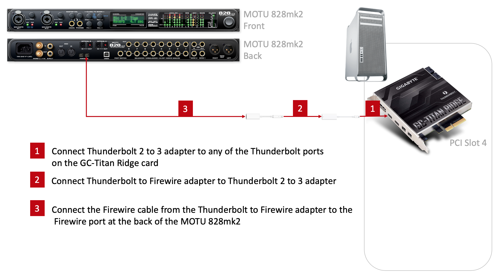
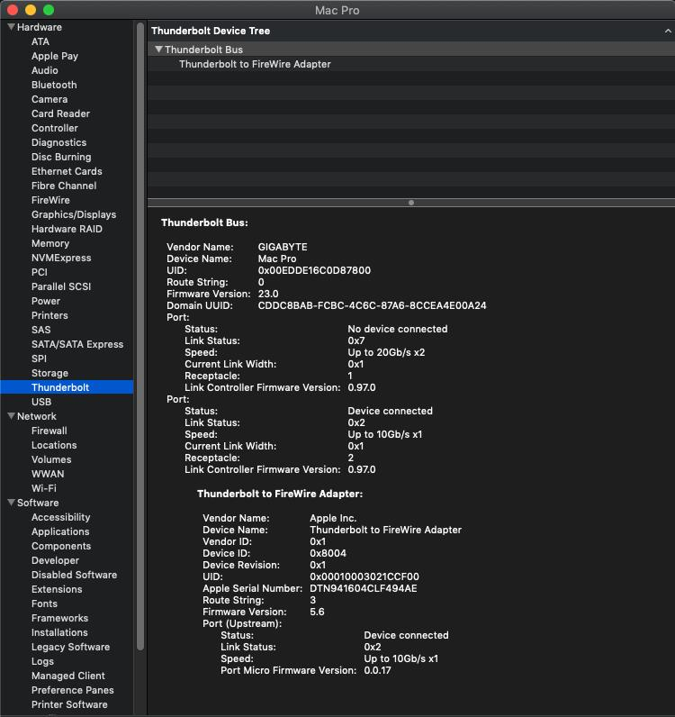
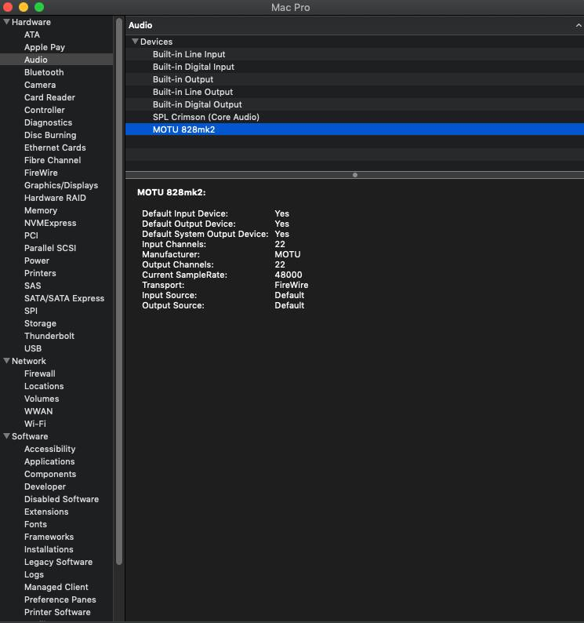

| [Home](./README.md) ▸ [Thunderbolt Mac Pro Early 2009 with Gigabyte GC-Titan Ridge Card](./GC-TitanRidge.md) ▸ Mac Pro + MOTU 828mk2 Hybrid Audio Interface |
|-----|

# Mac Pro + MOTU 828mk2 Hybrid Audio Interface

**Contribute By:** [Mick Terry](ttps://www.facebook.com/mick.terry)

This is the story to get MOTU 828mk2 Hybrid Audio Interface working with Mac Pro  assuming that Thunderbolt support is already added using Gigabyte GC-Titan Ridge Card. A full detailed guide to add Thunderbolt support using a Gigabyte GC-Titan Ridge Card to a Mac Pro 5,1 is [here](../GC-TitanRidge.md). Before we begin a quick disclaimer below.

**Difficulty Level:** Easy

> **Disclaimer:** Try this at your own risk. I do not guaranty that this will work for you but I hope it does. This is purely for educational purposes and I am not responsible for any void in warranty. This is not a end all be all guide for getting the GC-Titan Ridge thunderbolt card working for every use case. These steps have worked for me but there might be additional steps that might be required for getting other thunderbolt devices to work. Please follow the links mentioned in the the `Useful Links` section below for more update to date information about the community postings on this topic.

## Prerequisites

- Mac Pro with Thunderbolt Support using Gigabyte GC-Titan Ridge Card [link](../GC-TitanRidge.md)
- MOTU 828mk2 Hybrid Audio Interface
- Apple Thunderbolt 3 to Thunderbolt 2 Adapter [link](https://www.amazon.com/dp/B01MQ26QIY/ref=cm_sw_em_r_mt_dp_U_SfPBEbC8Q79Y5) ~$50
- Apple Thunderbolt to FireWire Adapter [link](https://www.amazon.com/Apple-Thunderbolt-to-FireWire-Adapter/dp/B00SQ2CJUS) ~$30

## My Upgrade Journey

### Install MOTU Audio Installer 

Downloaded and install the MOTU Audio Installer that contains all the required drivers prior to installing the custom firmware flashed GC-Titan Ridge card in the Mac Pro. 

The installer can be downloaded at [Motu Website](https://motu.com/download/)

### Setup

High level setup diagram is as follows:

### Power on MOTU 828mk2 Hybrid Audio Interface and then Bootup Mac Pro

**Important**

Before you start your Mac Pro power on the MOTU 828mk2 Hybrid Audio Interface.

Cold boot into Mojave followed by an immediate restart. The Thunderbolt card is always recognized on the cold boot, as is the Thunderbolt to Firewire adapter, but, it requires the restart in order to recognize the MOTU interface.

### Working MOTU 828mk2 Hybrid Audio Interface

Firewire Adapter is recognized.

System Report Audio section will show MOTU 828mk2 as a valid audio source.

828mk2 should be detected in the Motu Audio Setup App.

### OS tested 

This is working on the following macOS versions:

- High Sierra 10.13.6
- Mojave 10.14.6

**Note:** I do not recommend or support installing unsupported macOS on your Mac Pro.

### Known Issues

Known issues so far are:

## Useful Links

- https://create.pro/titan-ridge-macos-firmware-release-download-now/?fbclid=IwAR2JecJfqwVpN3RNUsjvJce6pWDZJQQhOh-HbGptPRnJcPB-k9cgjIaIUhk
- https://linux.die.net/man/8/flashrom
- https://themacadmin.com/2012/02/15/mounting-the-efi-boot-partition-on-mac-os-x/
- https://www.macworld.co.uk/how-to/mac-software/mac-recovery-mode-3674052/
- https://forums.macrumors.com/threads/testing-tb3-aic-with-mp-5-1.2143042/page-27?post=28226897&fbclid=IwAR35B8htzngqkwVeMRcYC8FnC4dgu5NaaV777pmAdlQY-vxw-OQWLcUXydU#post-28226897
- https://forums.macrumors.com/threads/opencore-on-the-mac-pro.2207814/
- https://forums.macrumors.com/threads/testing-tb3-aic-with-mp-5-1.2143042/post-28261032
- https://motu.com/download/
- https://motu.com/products/motuaudio/828x#firewire

