[Home](./README.md) ▸ Thunderbolt Mac Pro Early 2009 with Gigabyte GC-Titan Ridge Card


# [Thunderbolt Mac Pro Early 2009 with Gigabyte GC-Titan Ridge Card](https://ameyrupji.github.io/thunderbolt-macpro-5-1/GC-TitanRidge.html)

This is my story to add Thunderbolt support to my Mac Pro Early 2009 (5,1) with a Gigabyte GC-Titan Ridge Card. Before we begin a quick disclaimer below.

**Difficulty Level:** Medium

> **Disclaimer:** Try this at your own risk. I do not guaranty that this will work for you but I hope it does. This is purely for educational purposes and I am not responsible for any void in warranty. This is not a end all be all guide for getting the GC-Titan Ridge thunderbolt card working for every use case. These steps have worked for me but there might be additional steps that might be required for getting other thunderbolt devices to work. Please follow the links mentioned in the the `Useful Links` section below for more update to date information about the community postings on this topic.


## About my Mac Pro 5,1

My mac pro has the following configurations:

- Processor:        2 x 3.33 Ghz 6-Core Intel Xeon (X5680)
- Memory:           96 GB 1066 Mhz DDR3 ECC
- Graphics          AMD Radeon RX 580 8 GB

My purchase and upgrade story can be found [here](https://ameyrupji.github.io/macpro-5-1/) ([Github View](https://github.com/ameyrupji/macpro-5-1)).

## Prerequisites

- Obviously a Mac Pro and a Gigabyte GC-Titan Ridge Card [Amazon](https://amzn.to/2Aadohl)
- EEPROM Flash Bios USB Programmer [Amazon](https://amzn.to/37kgwTJ)
- Custom firmware for the Gigabyte GC-Titan Ridge Card v2.0 [Download](https://forums.macrumors.com/threads/testing-tb3-aic-with-mp-5-1.2143042/post-28291766). Links to old fimware can be found [here](./GC-TitanRidge-CustomFirmware.md)).


## My Upgrade Journey

### Gigabyte GC-Titan Ridge Card package contents

Here is a information about the package contents of Gigabyte GC-Titan Ridge Card [Link](https://www.gigabyte.com/us/Motherboard/GC-TITAN-RIDGE-rev-10#kf).

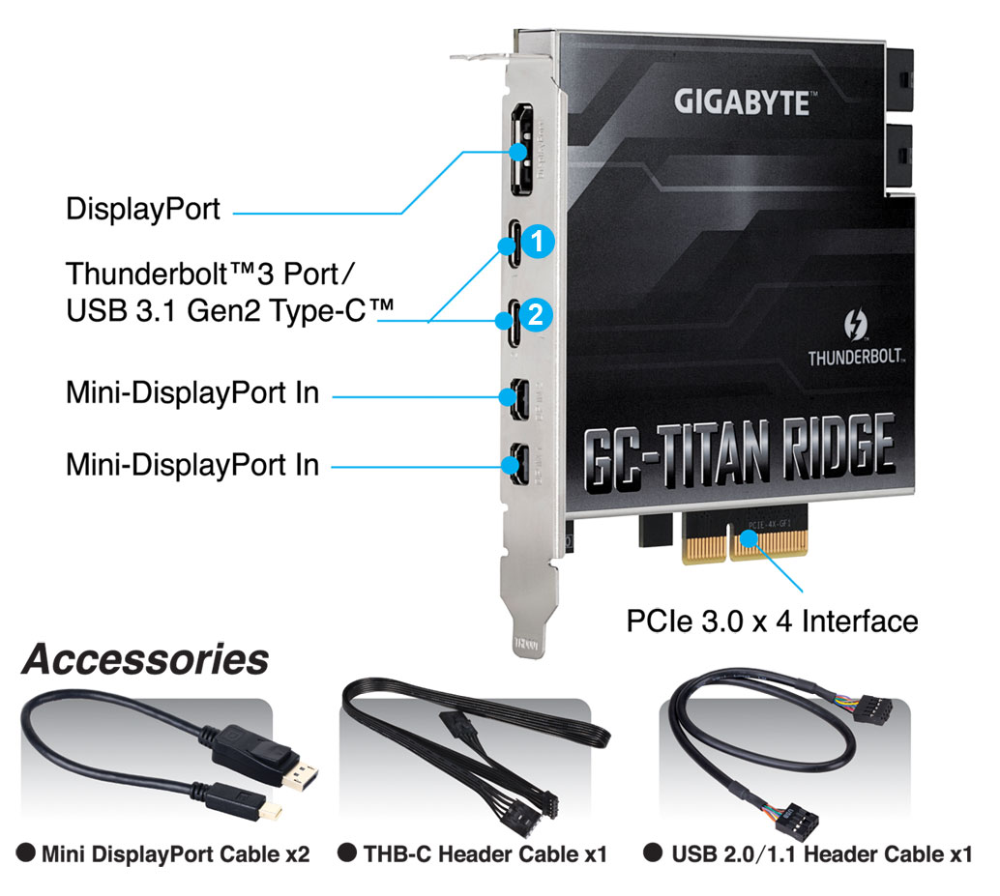
**Source:** Gigabyte Website [Link](https://www.gigabyte.com/us/Motherboard/GC-TITAN-RIDGE-rev-10#kf)

### Disassemble GC-Titan Ridge

Once you unbox your titan ridge card it should look like this:

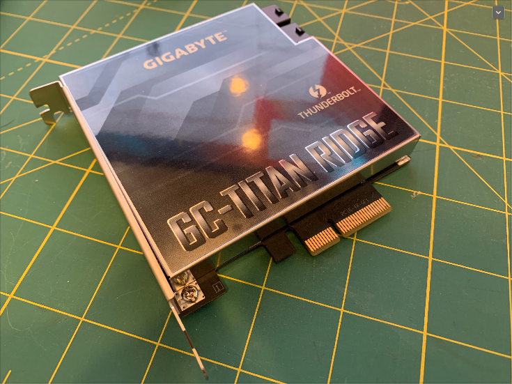

Unscrew the 4 philips head screws to expose the PCB:

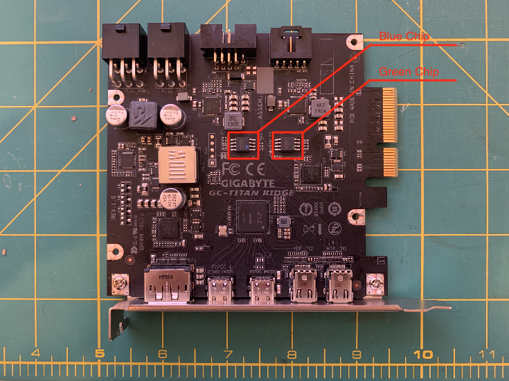:

The blue and the green chips that need to be flashed have a small dot with their respective colors.


### Install flashrom using brew

```
brew install flashrom
```


### Assembling Programmer

Look at the directions on the numbers on the green small board while assembling your programmer.


### Connect to the blue chip 

Align the programmer as shown in the image below focus on one side of the clip first. Align one side and then the other side pushing down firmly.


### Verify flashrom can detect your CH341A 24 25 Series EEPROM Flash Bios USB Programmer

```
flashrom -p ch341a_spi
```


### Backup your Blue Chip Firmware

```
flashrom -p ch341a_spi -r OriginalFirmware-BlueChip.bin
```


### Connect to green chip

Align the programmer as shown in the image below focus on one side of the clip first. Align one side and then the other side pushing down firmly.


### Backup green chip firmware

```
flashrom -p ch341a_spi -r OriginalFirmware-GreenChip.bin
```


### Connect to the blue chip and flashing TitanRidgeMacOSFirmware.bin custom firmware

Connect to blue chip again to be able to flash the firmware.


```
flashrom -p ch341a_spi -w TitanRidgeMacOSFirmware.bin
```


### Optional: Verify TitanRidgeMacOSFirmware.bin firmware is applied correctly

```
flashrom -p ch341a_spi -v TitanRidgeMacOSFirmware.bin
```


Alternate verify - Check against original blue chip firmware should fail:

```
flashrom -p ch341a_spi -v OriginalFirmware-BlueChip.bin
```

### Connect pin 3 and pin 5 of jumper for Hot Swap capability

**Update:** March 14th, 2020

Lets now try connecting pin 3 and pin 5 of the THB_C Header Cable provided. Some folks have reported that without this their Mac freezes on boot. Have not noticed this issue on my end. [Reference Link](https://forums.macrumors.com/threads/testing-tb3-aic-with-mp-5-1.2143042/post-28261162).

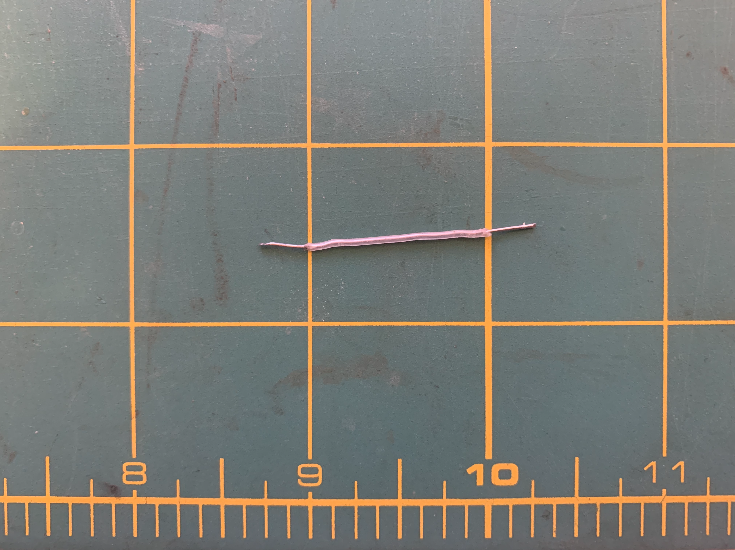

When connected the jumper from pin 3 to pin 5 should look like this.

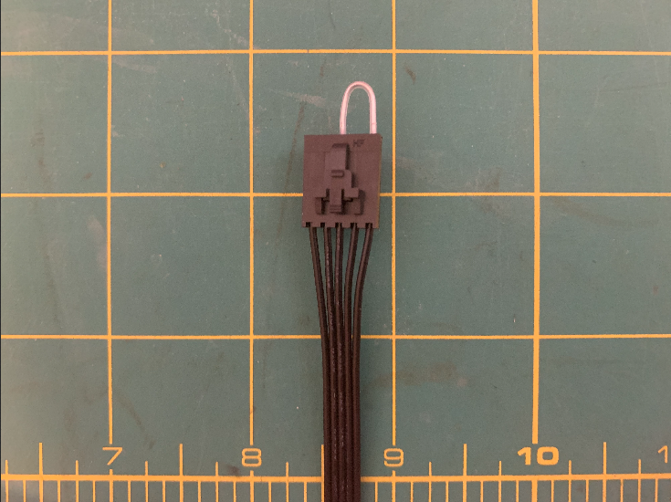

Connect this other end of the THB_C Header to the card into the J1 Header port of the card.

Alternate approaches suggested by community:

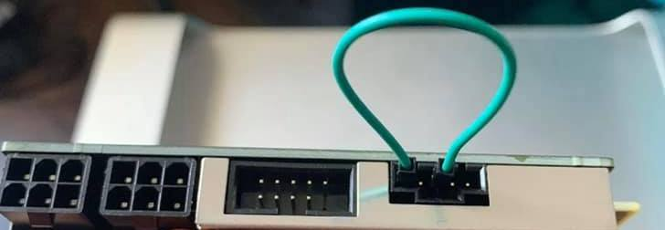
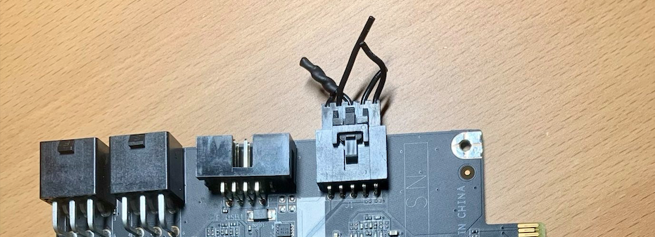
### Connect the card into the system

I connected this card in Slot 4 of my PCIE on Mac Pro. 

I also connected the display port outputs on my RX580 to the Mini Display input on the card (I did this as I want to use GC-Titan Rige card to power my Thunderbolt Displays).


Inner view:

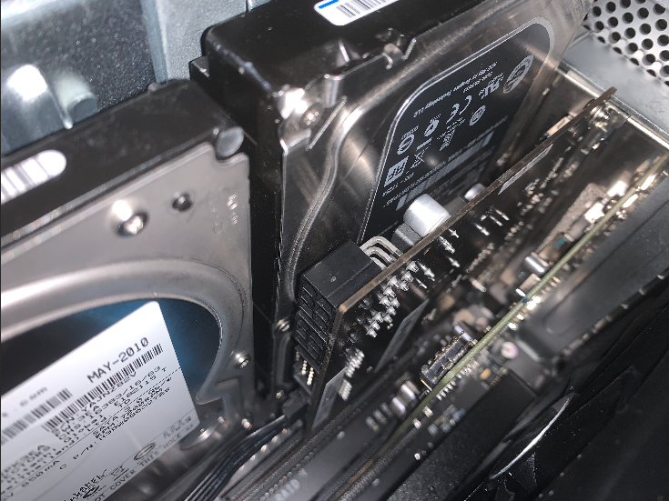

### Find and mount EFI disk 

> **Note:** Do this steps listed below if you want to OpenCore your Mac.

```
diskutil list
sudo diskutil mount /dev/disk0s1
```


### Copy Contents of MacPro5.1 OpenCore.zip file into the mounted EFI drive 

I already had a EFI folder within the drive. I got an alert asking to  merge or update the contents. I chose Merge. The Final folder looked like this:

 


### Bless EFI drive to enable OpenCore

> **Note:** I used my original graphic card while I was trying to boot into the recovery drive.

To boot into recovery mode hold down the `Command (⌘) + R` key after turning on the Mac Pro.

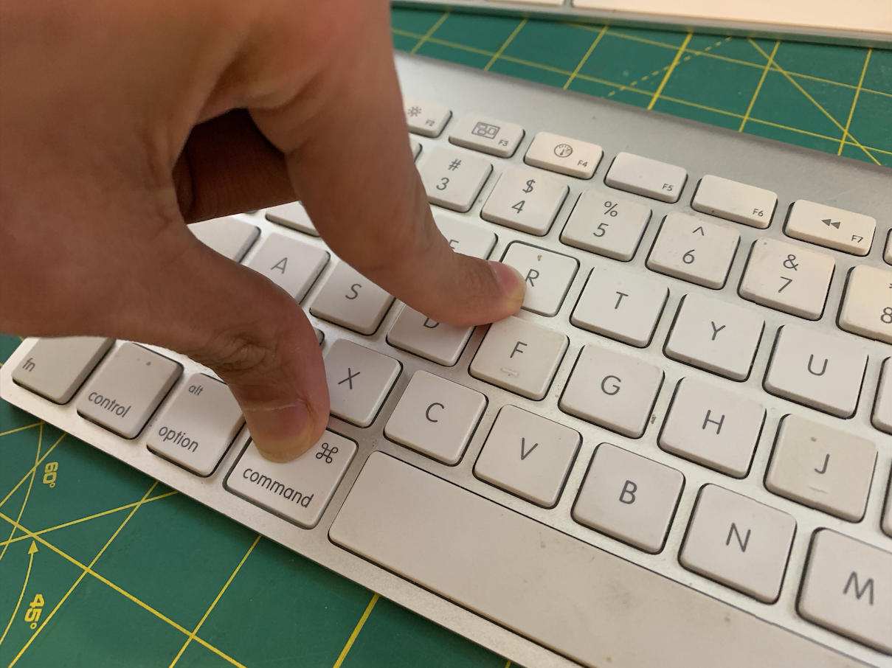

Follow the [instructions](https://forums.macrumors.com/threads/opencore-on-the-mac-pro.2207814/) on the official OpenCore documentation to OpenCore your Mac. This includes the following:

Open the terminal and run the following commands to make your EFI drive bootable (bless)

- Figure out the EFI disk using the `diskutil list`
- Mounting the EFI drive using the command `diskutil mount /dev/{efi_disk}`
- Set the mounted EFI partition for booting `bless --mount /Volumes/EFI --setBoot`
- Shut down the Mac and do an SMC reset (unplug the power cord, wait 15 seconds, plug the power cord back in, wait 5 seconds, and then press the power button)


### Boot to see the OpenCore boot screen

You should see the OpenCore boot screen on your next boot.

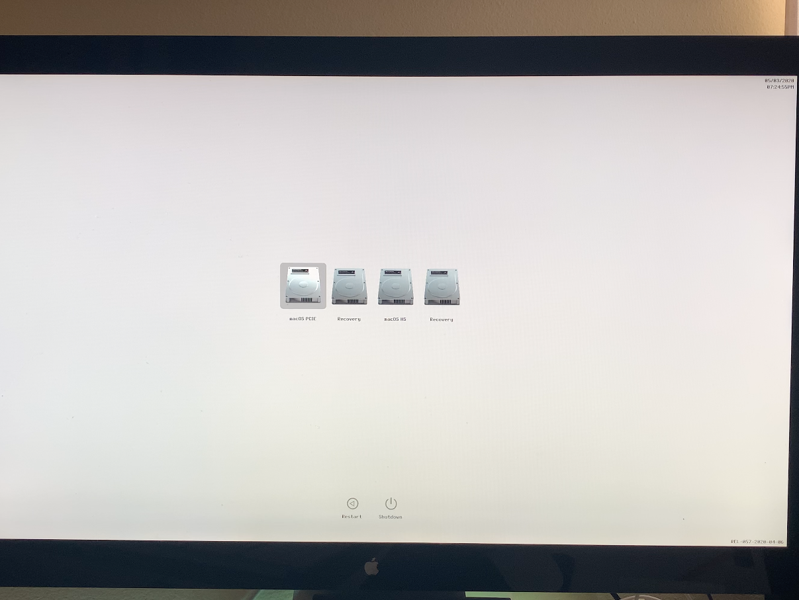


### View System Report of your MacPro

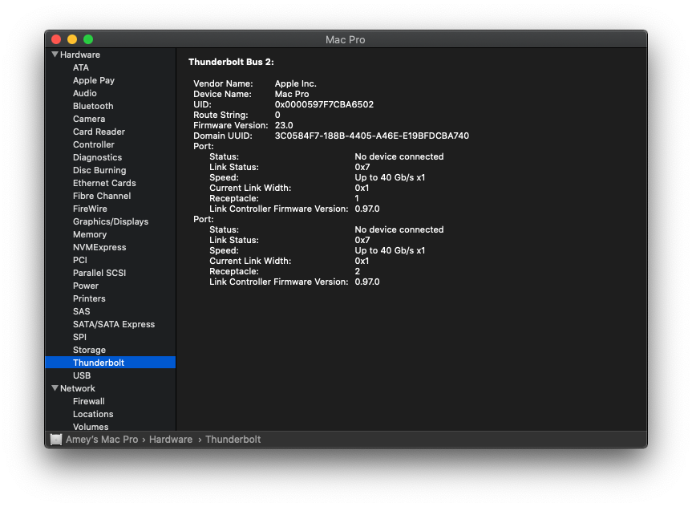

After the Apple Thunderbolt Displays are connected to the system they work in Daisy Chaining and the following is shown in the System report. I have also tried to Hot Swap the displays successfully.


The card is also detected successfully as a PIC Hardware as a thunderbolt and USB 3.1 device.


### USB 3.1

The USB 3.1 / USB-C port on the card worked successfully to connect to and transfer data to. The screenshot of the System Report with USB 3.1 and Disk Utility showing the attached Drive is as shown below:

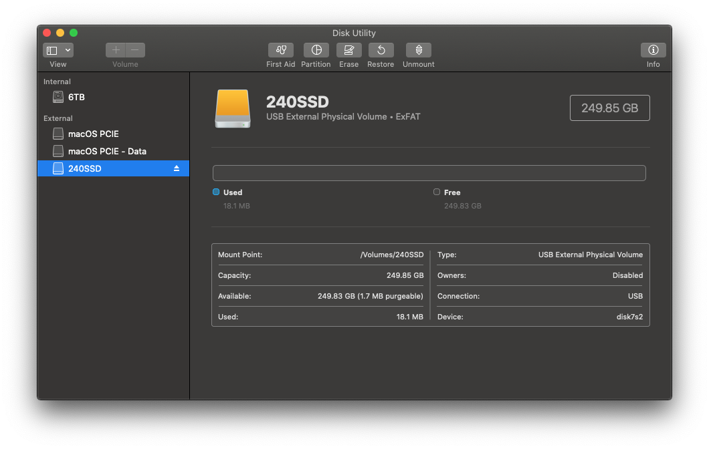
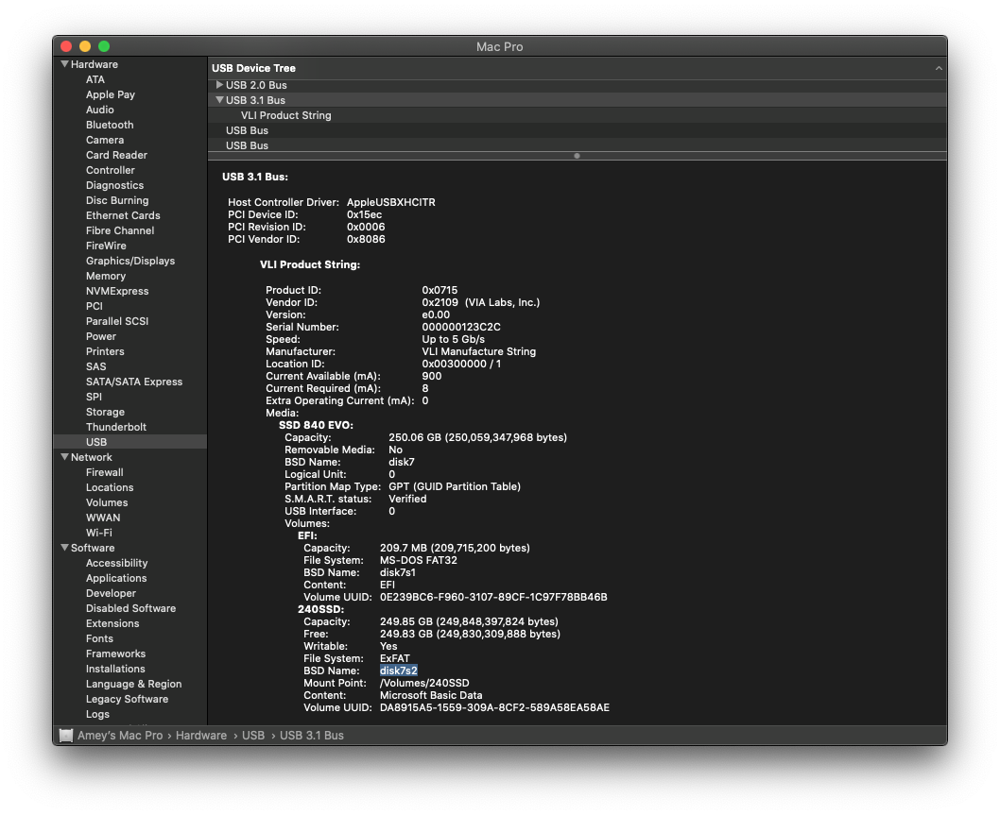

BlackMagic Speed Test with a mSata SSD. This test was done while on of the USB-C port was connected to 2 Apple Thunderbolt displays.

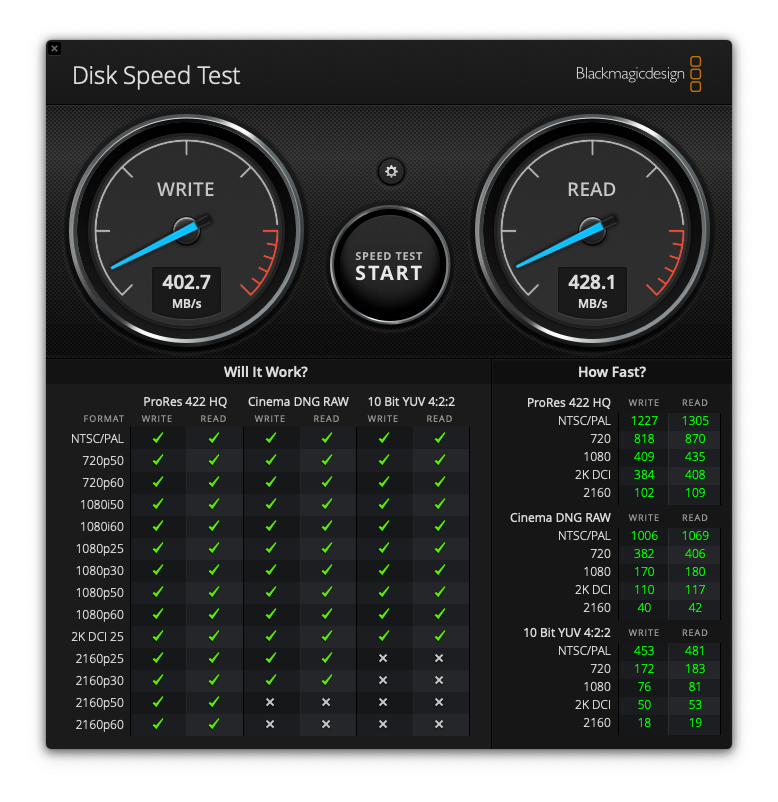


### Thunderbolt devices tested

- Apple Thunderbolt Display [link](./GC-TitanRidge-AppleThunderboldDisplay.md)
- MOTU 828mk2 Hybrid Audio Interface [link](./GC-TitanRidge-MOTU828mk2HybridAudioInterface.md)

### USB devices tested

- External SSD (mSata) [Link](https://amzn.to/37BVy2Z) connected via USB-C cable [Link](https://amzn.to/37AzSEr) **full writeup coming soon with seed test**


### OS tested 

I have tested this is working on the following Operating Systems:

- Mojave 10.14.6 (Officially supported with Metal supported cards)
- Catalina 10.15.3 
- Windows 10 with Bootcamp 6.1.0

**Note:** I do not recommend or support installing unsupported macOS on your Mac Pro.

### Known Issues

Issues that I have notices so far:

- ~~Hot swap devices works till at-least one device is connected to the GC-TITAN RIDGE card. I have only tried this with my thunderbolt displays if I connect one display to the card and leave it connected to the the card I can disconnect the second from the card or daisy chain and works after reconnecting. But if I remove both and try to reconnect then none of them work.~~ Solved by Connect pin 3 and pin 5 of jumper refer this section above.
- ~~I am using A pair of Apple Thunderbolt Display and have notices that the brightness functionality and USB ports behind the Thunderbolt display do not work.~~ Restart your system after a cold boot to enable USB and FaceTime HD Cameras on the Apple Thunderbolt displays. 

## Useful Links

- https://create.pro/titan-ridge-macos-firmware-release-download-now/?fbclid=IwAR2JecJfqwVpN3RNUsjvJce6pWDZJQQhOh-HbGptPRnJcPB-k9cgjIaIUhk
- https://linux.die.net/man/8/flashrom
- https://themacadmin.com/2012/02/15/mounting-the-efi-boot-partition-on-mac-os-x/
- https://www.macworld.co.uk/how-to/mac-software/mac-recovery-mode-3674052/
- https://forums.macrumors.com/threads/testing-tb3-aic-with-mp-5-1.2143042/page-27?post=28226897&fbclid=IwAR35B8htzngqkwVeMRcYC8FnC4dgu5NaaV777pmAdlQY-vxw-OQWLcUXydU#post-28226897
- https://forums.macrumors.com/threads/opencore-on-the-mac-pro.2207814/
- https://ss64.com/osx/bless.html
- https://forums.macrumors.com/threads/testing-tb3-aic-with-mp-5-1.2143042/post-28261032


## References to this Doumentation

**Writeups**

- https://www.pro-tools-expert.com/production-expert-1/2020/2/28/thunderbolt-3-on-mac-pro-51-cheese-grater-one-step-closer
- https://forums.macrumors.com/threads/testing-tb3-aic-with-mp-5-1.2143042/post-28293660
- https://forums.macrumors.com/threads/can-someone-please-make-a-titan-ridge-how-to-guide.2226638/post-28293877
- https://www.tonymacx86.com/threads/success-gigabyte-designare-z390-thunderbolt-3-i7-9700k-amd-rx-580.267551/page-2175
- https://www.tonymacx86.com/threads/asus-x299-catalina-support.279556/post-2126072
- https://uadforum.com/apollo-arrow-interfaces/44353-mac-pro-5-1-2012-universal-audio-apollo-twin-thunderbolt-2-a.html#post340850
- http://blog.greggant.com/posts/2018/05/07/definitive-mac-pro-upgrade-guide.html#thunderbolt
- https://forum.amd-osx.com/index.php?threads/ssdt-for-flashed-gc-titan-ridge.151/post-1934

**Videos**

 - ULTIMATE Mac Pro Thunderbolt upgrade! (By [PRESS RESET](https://www.youtube.com/channel/UCYfOQDGx24ZWrE-EUv_jSdw)) [YouTube](https://youtu.be/V9PtIa81FnI)
 - Thunderbolt 3 on Classic Mac Pro flashing GC-Titanridge full tutorial (By [OFXCPRODUCTIONS](https://www.youtube.com/channel/UCKf9SgUZVbqmd1fQDpI4njw)) [YouTube](https://youtu.be/R6jrc3TxQDc)
