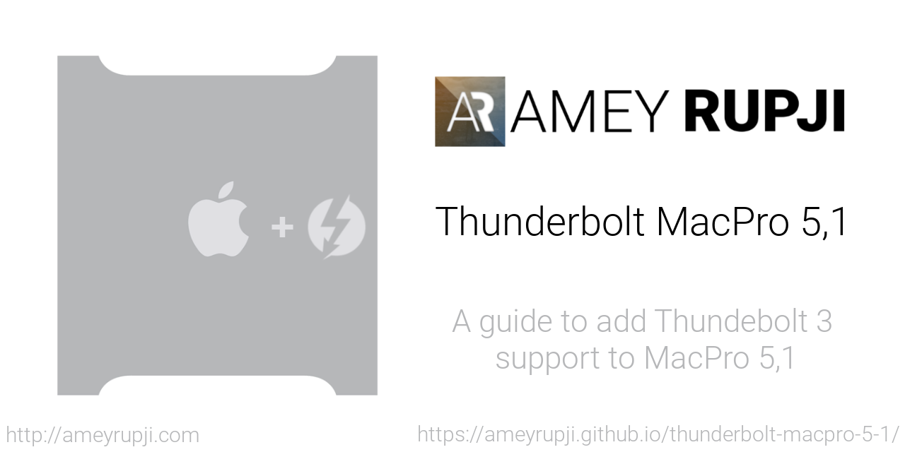

# [Thunderbolt Mac Pro Early 2009 (5,1)](https://ameyrupji.github.io/thunderbolt-macpro-5-1/)

Web Link: [https://ameyrupji.github.io/thunderbolt-macpro-5-1/](https://ameyrupji.github.io/thunderbolt-macpro-5-1/)

This is my story to add Thunderbolt support to my Mac Pro Early 2009 (5,1). Before we begin a quick disclaimer below.

> **Disclaimer:** Try this at your own risk. I do not guaranty that this will work for you but I hope it does. This is purely for educational purposes and I am not responsible for any void in warranty. This is not a end all be all guide for getting the GC-Titan Ridge thunderbolt card working for every use case. These steps have worked for me but there might be additional steps that might be required for getting other thunderbolt devices to work. Please follow the links mentioned in the the `Useful Links` section below for more update to date information about the community postings on this topic.
## About my Mac Pro 5,1

My mac pro has the following configurations:

- Processor:        2 x 3.33 Ghz 6-Core Intel Xeon (X5680)
- Memory:           96 GB 1066 Mhz DDR3 ECC
- Graphics          AMD Radeon RX 580 8 GB

My purchase and upgrade story can be found [here](https://ameyrupji.github.io/macpro-5-1/) ([Github View](https://github.com/ameyrupji/macpro-5-1)).

## My Thunderbolting Story 

I was in the market looking around for a PCIE based solution for running my Apple Thunderbolt Displays off of. I found the following options which look compelling looking at the reviews:

- ASUS Expansion Card for Z170 & X99 Motherboards ThunderboltEX 3 [Amazon](https://amzn.to/3h8Ubgp) ~$60.
- Gigabyte GC-Titan Ridge (Titan Ridge Thunderbolt 3 PCIe Card Component) [Amazon](https://amzn.to/2Aadohl) ~$100.

Tried both these cards on my system and this are my thoughts:

- ASUS ThunderboltEX 3: Click [here](./ThunderboltEX3.md) for my findings.
- Gigabyte GC-Titan Ridge: Click [here](./GC-TitanRidge.md) for my findings.

## Support this work

- Amey Rupji [PayPal](https://paypal.me/AmeyRupji?locale.x=en_US)
- DSM2 [PayPal](https://paypal.me/DSM2Hackintosh?locale.x=de_DE)
