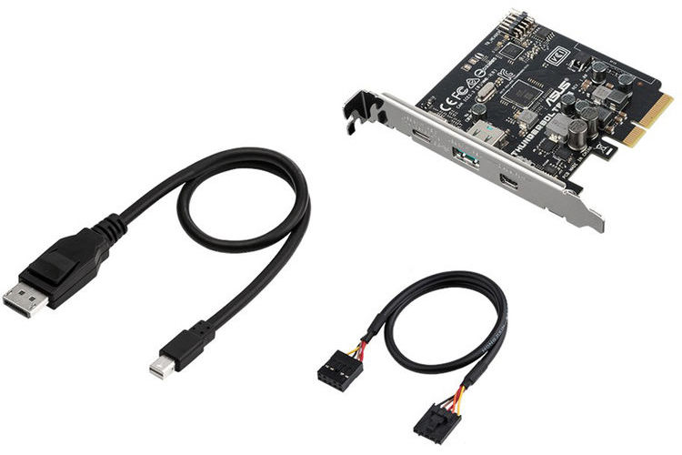
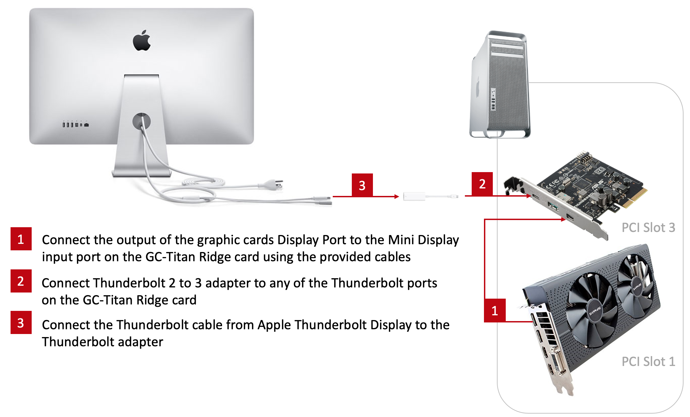
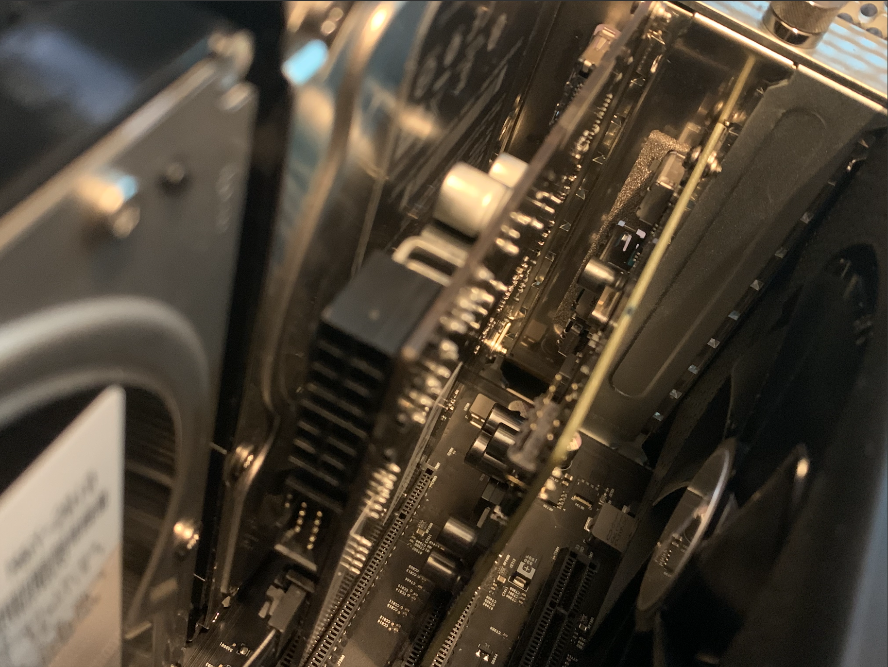

|  [Home](../README.md) ▸ Thunderbolt Mac Pro Early 2009 with Asus Thunderbolt EX3 |
|-----|

# [WIP] Thunderbolt Mac Pro Early 2009 with Asus Thunderbolt EX3

This is my story to add Thunderbolt support to my Mac Pro Early 2009 (5,1) with a Gigabyte GC-Titan Ridge Card. Before we begin a quick disclaimer below.

**Difficulty Level:** Easy

> **Disclaimer:** Try this at your own risk. I do not guaranty that this will work for you but I hope it does. This is purely for educational purposes and I am not responsible for any void in warranty. This is not a end all be all guide for getting the GC-Titan Ridge thunderbolt card working for every use case. These steps have worked for me but there might be additional steps that might be required for getting other thunderbolt devices to work. Please follow the links mentioned in the the `Useful Links` section below for more update to date information about the community postings on this topic.

## About my Mac Pro 5,1

My mac pro has the following configurations:

- Processor:        2 x 3.33 Ghz 6-Core Intel Xeon (X5680)
- Memory:           96 GB 1066 Mhz DDR3 ECC
- Graphics          AMD Radeon RX 580 8 GB

## Prerequisites

- Obviously a Mac Pro and a Asus Thunderbolt EX3 [Amazon](https://www.amazon.com/gp/product/B01HDUVJ54/ref=ppx_yo_dt_b_asin_title_o04_s00?ie=UTF8&psc=1)

## My Upgrade Journey

### Asus Thunderbolt EX3 Card package contents

Here is a information about the package contents of Gigabyte GC-Titan Ridge Card [Link](https://www.gigabyte.com/us/Motherboard/GC-TITAN-RIDGE-rev-10#kf).

**Source:** B&H Photo Video Website [Link](https://www.bhphotovideo.com/c/product/1267068-REG/asus_thunderboltex_3_expansion_card.html)

### Connect the card into the system

I connected this card in Slot 3 or 4 of my PCIE on Mac Pro. 

I also connected the display port outputs on my RX580 to the Mini Display input on the card (I did this as I want to use Asus Thunderbolt EX3 card to power my Thunderbolt Displays).

Inner view:

